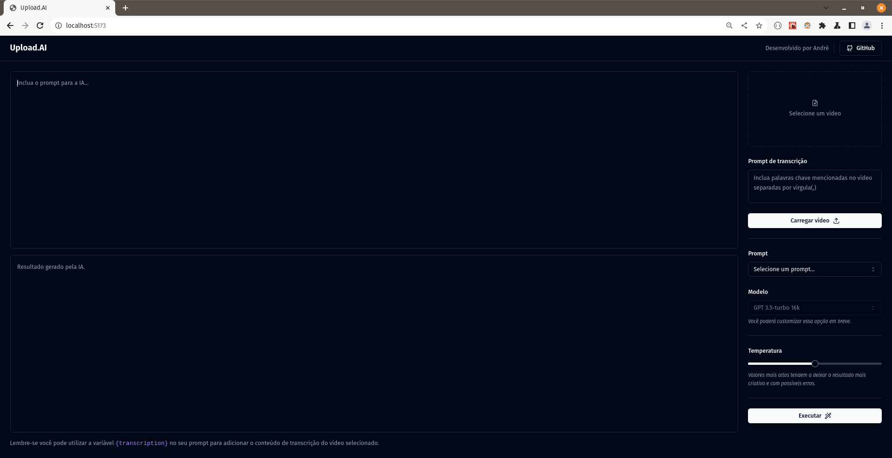

# Upload AI assistant
This assistant was created during the NLW AI event hosted by [Rocketseat]! 

## Details
This assistant service will use AI transcription and prompt generation to create diverse number of templates and prompts based
on the audio from video transcription and also extract major highlights to create a description for it.

 ### Features:
 - All the backend is provided by NodeJS and the database is made at SQLite managed using Prisma.
 - The frontend is made with ReactJS using Vite framework.
 
 
## How to run the app
Download the repo, and use one of the following commands to run as develop instance:
 - For Server and Web: npm run dev  (on each folder).

## Authors

* **André Zottis** - *Initial work* - [AndreZottis](https://github.com/andrezottis)

## License

This project is licensed under the MIT License - see the [LICENSE.md](LICENSE.md) file for details

## Special Thanks
I just want to thank you [Rocketseat](https://rocketseat.com.br) for this awesome opportunity to learn NodeJS and React!

## Some Images of this application

